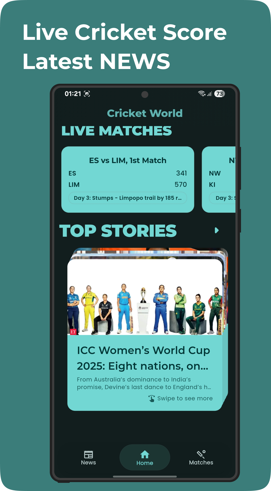
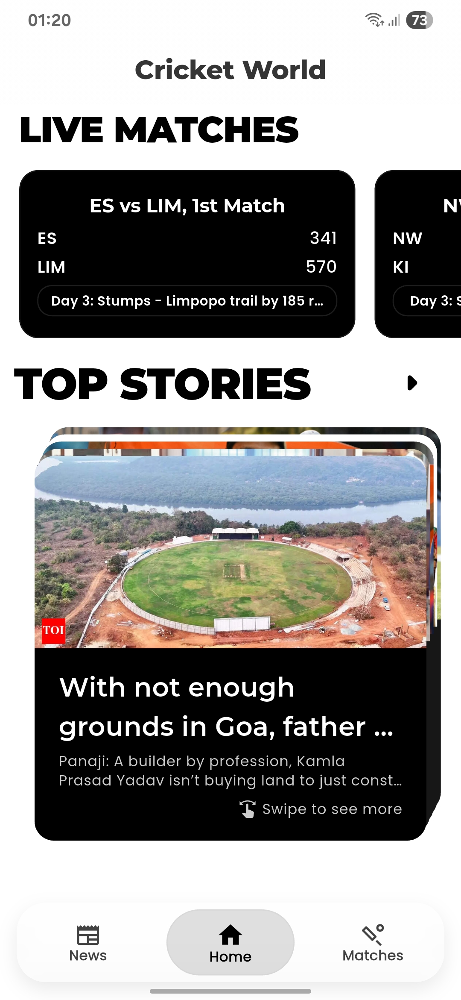
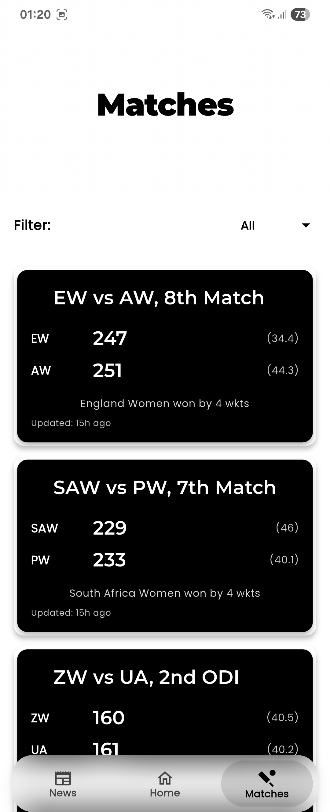
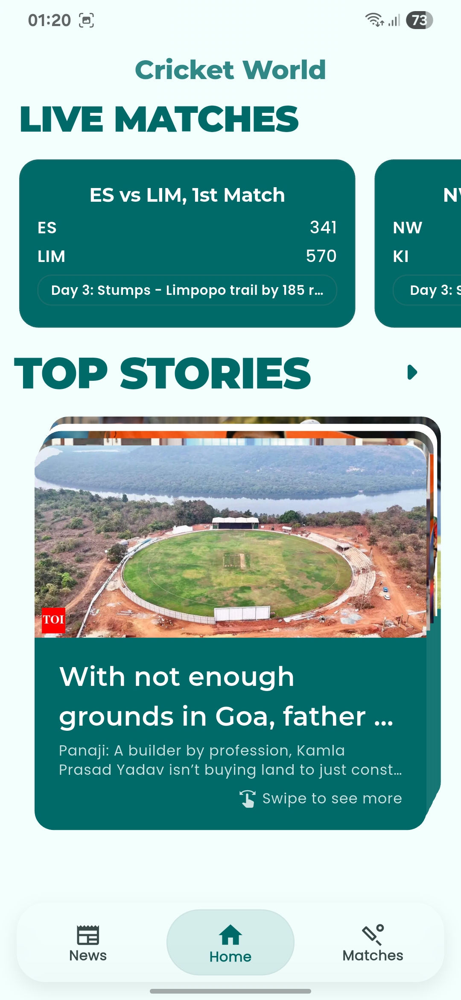
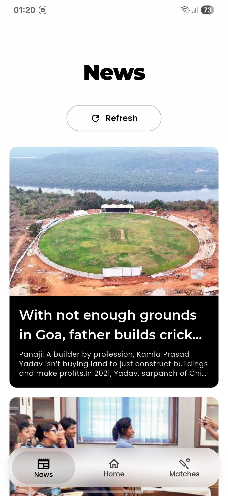

<div align="center">

# 🏏 World of Cricket

**Real-Time Cricket Intelligence, Live Match Scorecards & Machine Learning Win Predictor.**

[](https://flutter.dev)
[](https://dart.dev)
[](https://riverpod.dev)
[](https://www.tensorflow.org/lite)
[](https://onnxruntime.ai)
[](https://m3.material.io)
[](LICENSE)

<br/>



</div>

---

## 🌟 Overview

**World of Cricket** is a feature-rich, intelligent sports analytics mobile application built with **Flutter**, **Riverpod**, and embedded **Machine Learning** models. 

Designed for cricket enthusiasts, the app provides a seamless live match experience with instant scorecards, ball-by-ball updates, tournament schedules, and real-time win probability predictions powered by pre-trained **TensorFlow Lite** and **ONNX** inference models.

---

## 🚀 Key Features

### ⚡ Live Match Center & Match Analytics
- Interactive dashboards for **Live Matches**, **Upcoming Fixtures**, and **Recent Results**.
- Ball-by-ball commentary, overs breakdown, required run rates, wickets, and venue information.
- Resilient local caching: match summaries and scores remain accessible offline.

### 🧠 Machine Learning Win Predictor & Score Forecasting
- **Win Wiz Probability Engine**: Computes dynamic match outcome probabilities ball-by-ball based on current match context.
- **Embedded ML Inference**: High-efficiency, on-device prediction models using TFLite and ONNX.
- **In-App Testing Screen**: Built-in developer testing screen to experiment with custom match scenarios.

### 🎨 Tri-Theme Visual Engine
- **Dynamic Material 3**: Adapts seamlessly to system colors and Material 3 palettes.
- **Light & Dark Modes**: Engineered for optimal contrast and battery efficiency.
- **High-Contrast Monochrome Mode**: A bespoke black-and-white theme designed for distraction-free, minimalist viewing.
- **Typography**: Paired Google Fonts (`Montserrat` for expressive headlines, `Poppins` for crisp UI elements).

### 📰 Sports News & Insights
- Integrated cricket news feed with smooth Lottie animations.
- Real-time tournament updates, series recaps, and match reports.

---

## 🖼️ Visual Showcase

<div align="center">

| Live Matches Feed | Real-time Scorecard |
| :---: | :---: |
|  |  |

| Theme Settings & Customizer | Cricket News Feed |
| :---: | :---: |
|  |  |

| High-Contrast Monochrome Mode |
| :---: |
|  |

</div>

---

## 🏗️ Architecture

```
lib/
├── core/
│   ├── constants/         # App constants and configuration
│   ├── services/          # ThemeService & OnboardingService
│   ├── theme/             # AppThemes (Dynamic, Light, Dark, Monochrome)
│   └── widgets/           # ThemeSettingsScreen, TestModelScreen
└── feature/
    ├── matches_scores/    # Live scores presentation, domain & repository
    └── sports_news/       # News aggregation and reader screens
```

- **State Management**: Reactive state management handled via Riverpod providers.
- **Offline First**: Match data models with local fallback persistence.
- **Design System**: Material 3 theming with custom `ThemeExtension` tokens.

---

## ⚙️ Getting Started

### Prerequisites
- [Flutter SDK](https://flutter.dev/docs/get-started/install) (^3.8.0)
- [Dart SDK](https://dart.dev/get-dart) (^3.8.0)
- Android Studio / VS Code with Flutter extension

### Installation

1. **Clone the repository:**
   ```bash
   git clone https://github.com/hurairamuzammal/Cricket-world.git
   cd Cricket-world
   ```

2. **Install Flutter dependencies:**
   ```bash
   flutter pub get
   ```

3. **Run the Flutter application:**
   ```bash
   flutter run
   ```

---

## 👨‍💻 Developer & Contact

Developed with ❤️ by **Muhammad Abu Huraira**

- GitHub: [@hurairamuzammal](https://github.com/hurairamuzammal)
- Email: [huraira.eqeel@gmail.com](mailto:huraira.eqeel@gmail.com)

---

<div align="center">
  <sub>⭐ Found World of Cricket helpful? Consider giving this repository a star!</sub>
</div>
